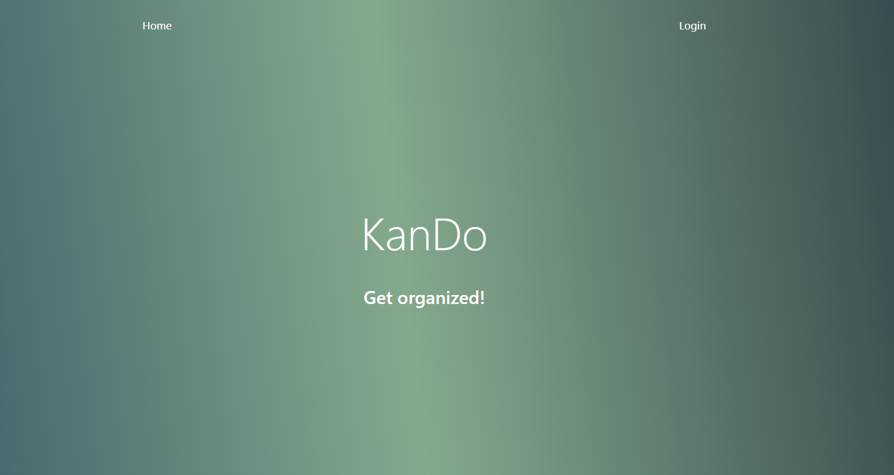

# KanDO

## Description

The motivation for this project was to give users a free and easy Kanban board that is user friendly and intuitive.
This Kanban board improves team collaboration and workflow, a Kanban board also helps teams manage their workload and prioritize tasks more effectively.

Screenshot

Deployed Application URL: https://project-03-kanban.herokuapp.com/

## Table of Contents (Optional)

- [KanDO](#kando)
  - [Description](#description)
  - [Table of Contents (Optional)](#table-of-contents-optional)
  - [Installation](#installation)
  - [Credits](#credits)
  - [License](#license)

## Installation

This repo is deployed on the URL above. You can also open the terminal and type "rpm run install", npm run seeds" to setup the database and "npm run develop".

## Credits

Daniel Graves: https://github.com/danielcgraves. 
Parker Greenwell: https://github.com/prkrgreenwell. 
Juana Maldonado: https://github.com/Jm1211  
Aaron Morgan: https://github.com/craymorgana. 

## License

The last section of a high-quality README file is the license. This lets other developers know what they can and cannot do with your project. If you need help choosing a license, refer to [https://choosealicense.com/](https://choosealicense.com/).
